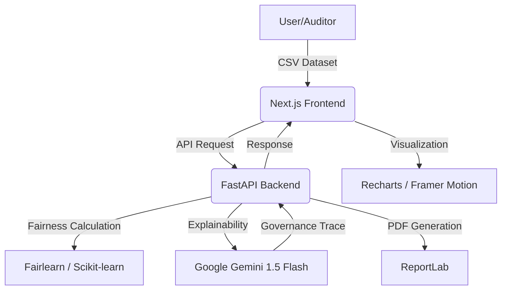

# Aegis One — Unbiased AI Decision Platform

[](https://nextjs.org/)
[](https://fastapi.tiangolo.com/)
[](https://deepmind.google/technologies/gemini/)
[](https://opensource.org/licenses/MIT)

> **Aegis One** is a high-fidelity, end-to-end platform built for the **Open Innovation Hackathon 2026**. It leverages Google's Gemini AI to provide transparent, explainable, and actionable AI fairness auditing for critical decision-making systems.

---

## 🌟 Key Features

- **🔍 Multi-Metric Bias Detection**: Analyze datasets using Disparate Impact Ratio, Demographic Parity Difference, Equalized Odds, and more.
- **🤖 Gemini Governance Trace**: Real-time AI explanations that translate complex mathematical fairness metrics into plain-English insights.
- **🛡️ Automated Mitigation**: Apply reweighing and threshold optimization algorithms with a single click.
- **📄 Audit-Ready Reporting**: Generate comprehensive PDF audit reports containing metric breakdowns and AI-generated remediation strategies.
- **🌌 Cinematic UI**: A high-performance, cosmic-themed dashboard built with Next.js and Tailwind CSS v4.

## 🏗️ Architecture



## 🛠️ Tech Stack

- **Frontend**: Next.js 14, TypeScript, Tailwind CSS v4, Recharts, Framer Motion.
- **Backend**: Python FastAPI, Fairlearn, AIF360, Pandas.
- **AI/ML**: Google Gemini 1.5 Flash, Google Cloud Run.
- **DevOps**: Docker, Google Cloud Build.

## 🚀 Getting Started

### Prerequisites

- Python 3.9+
- Node.js 18+
- [Google Gemini API Key](https://aistudio.google.com/)

### 1. Backend Setup

```bash
cd backend
python -m venv venv
source venv/bin/activate # or venv\Scripts\activate on Windows
pip install -r requirements.txt
# Create .env and add GEMINI_API_KEY=your_key_here
uvicorn main:app --reload --port 8000
```

### 2. Frontend Setup

```bash
cd frontend
npm install
# Ensure .env.local has NEXT_PUBLIC_API_URL=http://localhost:8000
npm run dev
```

Visit `http://localhost:3000` to see the dashboard in action!

## 📈 Success Metrics

- **Performance**: < 5s End-to-End Analysis Latency.
- **Reliability**: ±2% Detection Accuracy vs. Industry Baselines.
- **Impact**: ≥20% Bias Reduction with minimal accuracy trade-off.

## 📜 License

Distributed under the MIT License. See `LICENSE` for more information.

---

**Built with ❤️ for the AI Ethics & Fairness Track @ Open Innovation Hackathon 2026**
