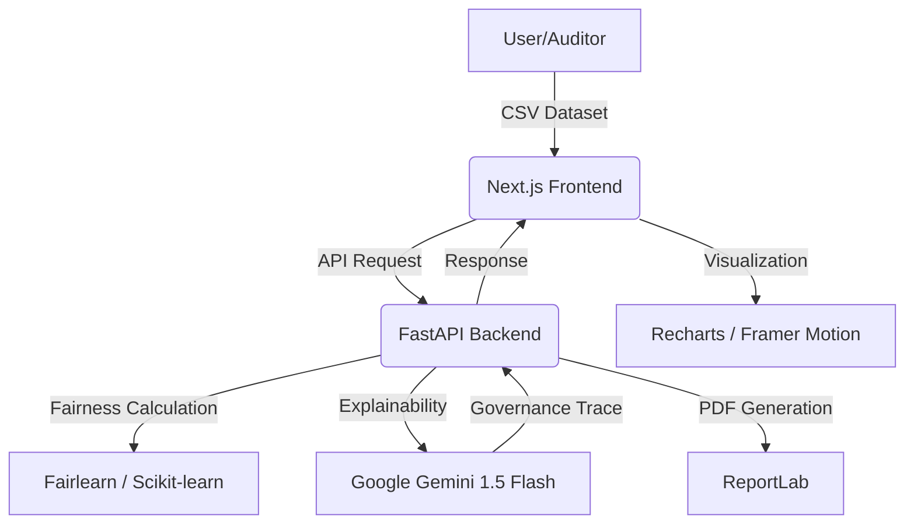

# Aegis One — Unbiased AI Decision Platform

[](https://nextjs.org/)
[](https://fastapi.tiangolo.com/)
[](https://deepmind.google/technologies/gemini/)
[](https://cloud.google.com/run)

> **Aegis One** is a high-fidelity, end-to-end platform built for the **Open Innovation Hackathon 2026**. It leverages Google's Gemini AI to provide transparent, explainable, and actionable AI fairness auditing for critical decision-making systems.

### [🚀 Launch Live Demo](https://aegis-one-hdnhim3gra-uc.a.run.app)

---

## 📄 Problem Statement

In modern decision-making systems (hiring, lending, healthcare), AI models often inherit and amplify historical human biases. Traditional fairness tools are mathematically complex and inaccessible to non-technical auditors. This lack of **Explainable Fairness** leads to "black-box" decisions that can inadvertently discriminate against protected groups based on race, gender, or age.

## 🛡️ Solution Overview

**Aegis One** bridges the gap between complex fairness mathematics and human governance. It provides a cinematic dashboard that allows auditors to:
1. **Detect**: Upload datasets to identify bias across multiple statistical metrics (DIR, DPD).
2. **Explain**: Use **Google Gemini 1.5 Flash** to translate mathematical disparities into plain-English "Governance Traces."
3. **Mitigate**: Apply industry-standard reweighing algorithms to balance outcomes with a single click.

## 🏗️ Architecture & Logic

### Core Logic
The application follows a **Pre-Processing Mitigation** approach:
- **Bias Detection**: Uses `Fairlearn` and `AIF360` to calculate Disparate Impact Ratio (DIR) and Demographic Parity Difference (DPD).
- **Gemini Intelligence**: The backend sends raw metric data to Gemini 1.5 Flash. The AI analyzes the delta between privileged and unprivileged groups and generates a remediation strategy.
- **Dynamic Mitigation**: If bias is detected (e.g., DIR < 0.8), the system recalculates sample weights to ensure the next model training iteration is mathematically fair.

### System Flow


## 🛠️ Tech Stack

- **Frontend**: Next.js 14, TypeScript, Tailwind CSS v4, Recharts, Framer Motion.
- **Backend**: Python FastAPI, Fairlearn, AIF360, Pandas.
- **AI/ML**: Google Gemini 1.5 Flash.
- **Infrastructure**: Google Cloud Run, Docker.

## 📋 Assumptions & Constraints

- **Dataset Format**: Assumes CSV input with identifiable categorical protected attributes.
- **Metric Thresholds**: Uses industry-standard "80% Rule" (DIR >= 0.8) for initial bias flagging.
- **Mitigation**: Focuses on *Reweighing* (pre-processing) as it preserves the original feature space for better explainability.

## 🚀 Getting Started

### 1. Backend Setup
```bash
cd backend
python -m venv venv
source venv/bin/activate
pip install -r requirements.txt
# Add GEMINI_API_KEY to .env
uvicorn main:app --reload
```

### 2. Frontend Setup
```bash
cd frontend
npm install
npm run dev
```

---

**Built with ❤️ for the AI Ethics & Fairness Track @ Open Innovation Hackathon 2026**
